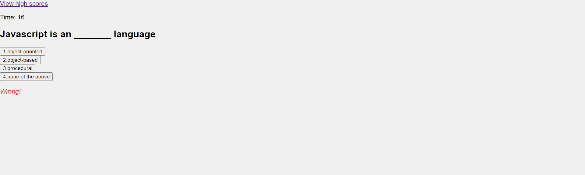

# Javascript Quiz
A timed multiple choice quiz about Javascript
## Description
The Javascript quiz is made to allow users to test their knowledge of coding. Once the start button is clicked, the user must race against the clock to answer questions about coding. Each incorrect answer will result in a 10 second deduction in time from the clock. When all questions are answered or the clock runs out, a score page is displayed which allows the user to input initials so that the score can be saved to a high scores page in local storage. The top 4 scores are saved in local storage with this application. An example of what the application looks like can be seen here: 

## User Story
AS A coding boot camp student
I WANT to take a timed quiz on JavaScript fundamentals that stores high scores
SO THAT I can gauge my progress compared to my peers

## Usage
The user is advised to start by clicking the start button on the starting page. Once the start button is pressed the user has 60 seconds to answer 5 questions about Javascript. With each correct answer the word "correct" will appear in green at the bottom of the quiz. For each incorrect answer the word "wrong" will appear in red and 10 seconds will be subtracted from the timer. The user is advised to enter their initials upon completion of the quiz so that their score can be saved to the high scores page. 

## Credits 
Many helpful tips were found on https://stackoverflow.co/ and https://www.w3schools.com/ All code was written from scratch by Luke Stroehlein with much research (and head-banging, and heartbreak) involved along the way.

## Special Note
For some reason this was the hardest challenge I've done so far. There were so many elements at play and I found myself overthinking a lot when trying to complete this project. At one point I decided to delete what I had and start completely over again because the approach I took the first time simply wasn't cutting it. I am incredibly happy to have made a functional application and hope you enjoy using it.

## License
Please refer to LICENSE in the repo.

## Link To Live Page

https://strolinedigital.github.io/Challenge-4-Quiz/